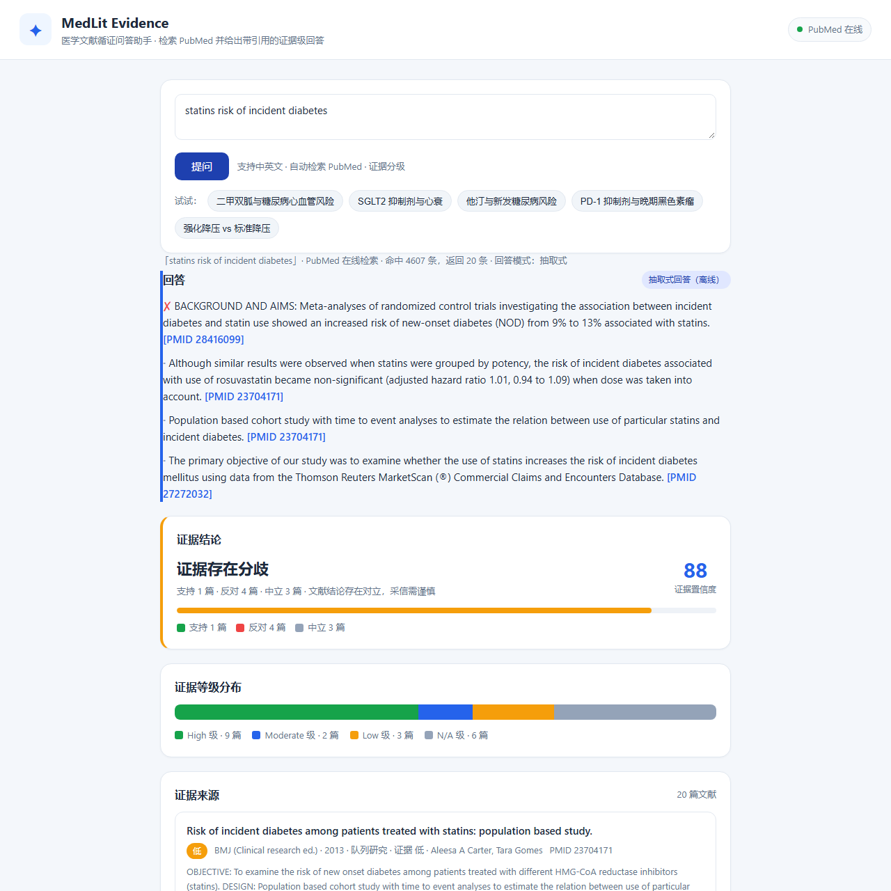

# MedLit Evidence

医学文献循证问答助手。输入一个临床问题（中英文均可），自动检索 PubMed 文献，按证据等级排序，并给出带 PMID 引用的循证回答。

它不给你一个"标准答案"。它告诉你三件事：证据怎么说、文献里有没有人持相反结论、这个结论有多可信。

一个最小可运行、零密钥、离线也能演示的 RAG 小产品。后端约 400 行 Python，前端一个静态页面，无重型依赖。



## 它解决什么问题

医生、医学编辑、科研人员和患者想快速查「某个干预有没有证据」，但直接搜 PubMed 要面对几十万条结果，还要自己判断研究类型和证据强弱。这个工具把这条链路自动化：

1. 理解问题（中文自动转英文检索词）
2. 检索 PubMed，召回相关文献
3. 按 BM25 相关性重排
4. 识别研究设计，按循证金字塔给每篇打证据等级
5. 从高证据文献里抽取关键句，合成带引用的回答
6. 识别每篇结论的方向（支持 / 反对 / 中立），检测是否存在对立的结论，给出证据置信度

通用大模型会自信地抹平文献里本就存在的矛盾，而循证医学的核心恰恰是把这些矛盾讲清楚。第 6 步就是这个产品区别于"搜 PubMed 的壳"的地方。

## 核心功能

- 中英文双语提问，中文医学术语自动映射到英文检索词（二甲双胍 → metformin，糖尿病 → diabetes 等 70+ 词条）
- 在线检索 PubMed E-utilities，覆盖 3800 万+ 篇文献；网络不可用时自动回退内置语料，演示永不断线
- 9 类研究设计自动识别（Meta 分析 / 系统综述 / 指南 / 随机对照试验 / 临床试验 / 队列 / 病例对照 / 病例报告 / 综述 / 基础研究）
- 5 档证据分级（高 / 中 / 低 / 极低 / 未分级），结果页展示证据等级分布
- 结论极性识别：自动判断每篇文献的结论是支持 / 反对 / 中立，回答的每一句都带方向标注
- 证据冲突检测：同一问题下若存在正反对立结论，明确提示"证据存在分歧"，而不是给一个假共识
- 证据置信度评分：综合证据等级 + 结论一致性 + 文献量 + 时效，给 0-100 分
- 抽取式回答，每个结论句都带 [PMID] 引用，可点击跳转 PubMed 原文
- 进程内 TTL 缓存，重复提问秒级返回

## 效果（实测）

| 指标 | 数值 |
| --- | --- |
| 单次问答延迟（冷启动，含两次 PubMed 网络往返） | 约 7.8 秒 |
| 命中缓存后延迟 | 约 6 毫秒 |
| 每次返回文献数 | 20 篇（可配置） |
| 文献覆盖 | PubMed 3800 万+ 篇 |
| 证据分级 | 5 档 / 9 类研究设计 |
| 结论极性 | 支持 / 反对 / 中立 3 类自动识别 |
| 证据置信度 | 0-100 分 |
| 单元测试 | 18 个全部通过 |
| 后端依赖 | 3 个（fastapi / uvicorn / httpx） |

## 技术选型

- 后端：FastAPI + Uvicorn（异步，单文件路由）
- 检索：BM25 纯 Python 实现，无 scikit-learn / nltk 依赖
- 数据源：PubMed E-utilities（esearch + efetch，免费无密钥）
- 分词：英文按词 + 停用词过滤，中文单字 + bigram，无需 jieba
- 研究设计识别：标题 + 摘要 + 发表类型的规则匹配，按优先级判定
- 结论极性 / 冲突检测 / 置信度：基于结论句的强短语优先 + 否定词感知规则，显式建模证据分歧
- 答案合成：默认抽取式（证据等级 + 关键词密度 + 结论句加权）；配置 OpenAI 兼容接口后升级为生成式（RAG）
- 前端：原生 HTML / CSS / JS，无框架，无构建步骤

## 快速开始

```bash
# 1. 安装依赖
pip install -r requirements.txt

# 2. 启动（可选设置 HTTP 代理访问 PubMed）
#    公司网络 / 沙箱环境需要代理时：
#    export PUBMED_PROXY=http://127.0.0.1:7890
uvicorn app.main:app --host 127.0.0.1 --port 8000

# 3. 浏览器打开
#    http://127.0.0.1:8000/
```

不装任何密钥也能跑：默认走离线抽取式回答；网络不通时回退内置语料，照样能演示。

### 可选：接入 LLM 升级为生成式回答

```bash
export LLM_API_KEY=sk-xxxx
export LLM_BASE_URL=https://api.openai.com/v1   # 任意 OpenAI 兼容接口
export LLM_MODEL=gpt-4o-mini
```

配置后回答改为生成式（RAG），未配置时自动回退抽取式。

## API

| 方法 | 路径 | 说明 |
| --- | --- | --- |
| GET | /health | 健康检查，返回 PubMed 是否在线 |
| POST | /api/search | 检索 + 分类，返回文献列表与证据等级 |
| POST | /api/answer | 完整问答，返回回答 + 引用 + 证据分布 |

请求示例：

```bash
curl -X POST http://127.0.0.1:8000/api/answer \
  -H "Content-Type: application/json" \
  -d '{"query": "metformin cardiovascular risk type 2 diabetes"}'
```

## 目录结构

```
medlit-evidence/
├── app/
│   ├── main.py          # FastAPI 路由与编排
│   ├── config.py        # 环境变量配置
│   ├── pubmed.py        # PubMed 客户端 + TTL 缓存
│   ├── retrieval.py     # BM25
│   ├── tokenizer.py     # 中英文分词
│   ├── translate.py     # 中文医学术语 → 英文检索词
│   ├── study_type.py    # 研究设计识别 + 证据分级
│   ├── evidence.py      # 结论极性 + 冲突检测 + 置信度评分
│   └── synthesizer.py   # 抽取式 / LLM 回答合成
├── data/
│   └── sample_corpus.json  # 离线 fallback 语料（11 篇 landmark 研究）
├── static/
│   ├── index.html
│   ├── style.css
│   └── app.js
├── tests/
│   ├── test_retrieval.py
│   ├── test_study_type.py
│   └── test_evidence.py
├── requirements.txt
└── README.md
```

## 证据分级规则

| 等级 | 研究设计 |
| --- | --- |
| 高 | Meta 分析 / 系统综述 / 指南 |
| 中 | 随机对照试验 / 临床试验 |
| 低 | 队列 / 病例对照 |
| 极低 | 病例报告 |
| 未分级 | 综述 / 基础研究 / 其他 |

## 测试

```bash
python -m unittest discover -s tests -v
```

## 免责声明

本工具输出仅供学习与信息参考，不构成医疗建议。临床决策请以最新指南和专业医师意见为准。离线语料中的摘要为演示用途的改写，非 PubMed 原文。

## License

MIT
