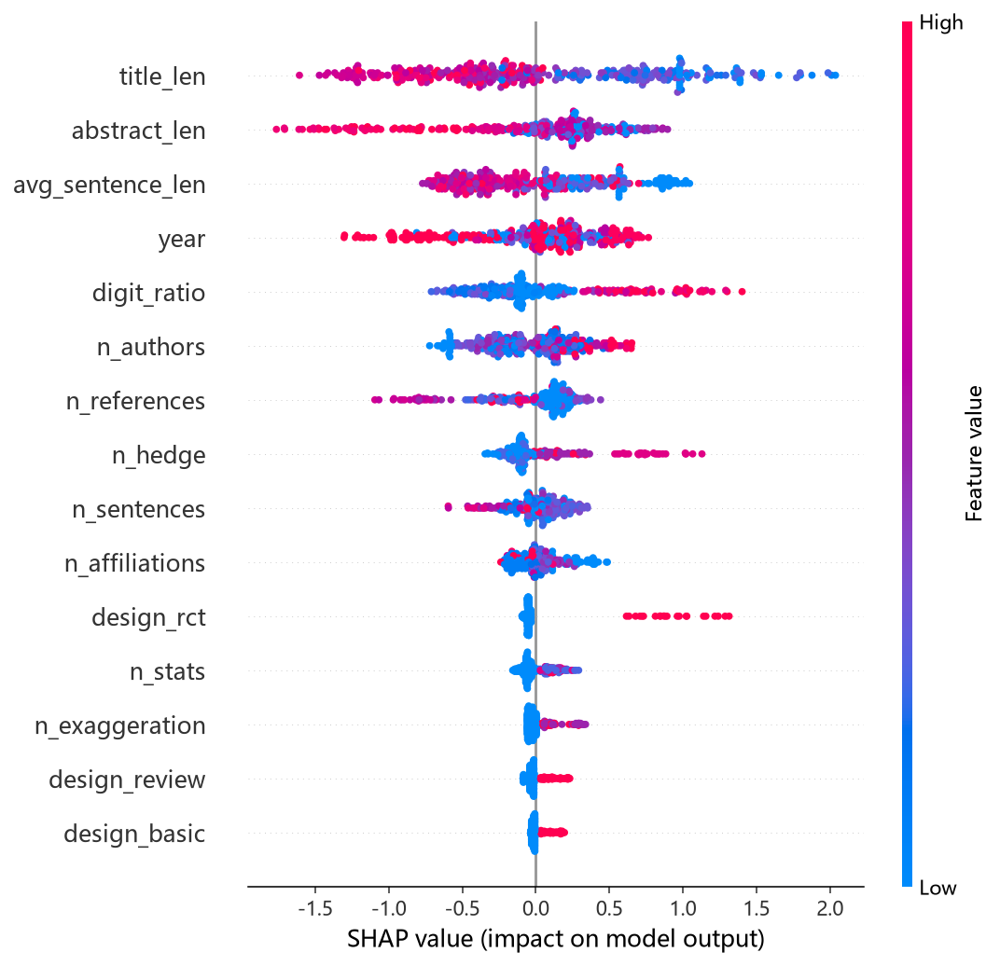

# 撤稿风险预测模型 · 实验报告

样本：360 篇（正样本 180 / 负样本 180），负样本为同期同刊 matched control。

## 模型对比（5 折分层交叉验证，均值 ± 标准差）

| 模型 | AUC | PR-AUC | F1 | Brier |
| --- | --- | --- | --- | --- |
| 逻辑回归 | 0.633 ± 0.068 | 0.611 ± 0.067 | 0.602 ± 0.079 | 0.246 ± 0.028 |
| LightGBM | 0.747 ± 0.089 | 0.714 ± 0.098 | 0.712 ± 0.061 | 0.212 ± 0.047 |
| 随机森林 | 0.723 ± 0.099 | 0.707 ± 0.094 | 0.697 ± 0.078 | 0.216 ± 0.027 |

PR-AUC 是类别不平衡下的主指标；AUC 衡量排序能力；Brier 衡量概率校准。

## SHAP 特征重要性（对「翻车」风险的影响大小）

| 排名 | 特征 | 平均 SHAP |
| --- | --- | --- |
| 1 | 标题长度 | 0.6759 |
| 2 | 摘要长度 | 0.4284 |
| 3 | 平均句长 | 0.3993 |
| 4 | 发表年份 | 0.3512 |
| 5 | 数字密度 | 0.3207 |
| 6 | 作者数 | 0.2556 |
| 7 | 参考文献数 | 0.2182 |
| 8 | 模糊限定词数 | 0.1775 |
| 9 | 摘要句数 | 0.1305 |
| 10 | 机构数 | 0.1101 |
| 11 | RCT | 0.1069 |
| 12 | 统计术语数 | 0.0797 |
| 13 | 夸张词数 | 0.0551 |
| 14 | 综述 | 0.0471 |
| 15 | 基础研究 | 0.0281 |
| 16 | 确定性措辞数 | 0.0133 |
| 17 | 资助数 | 0.0041 |
| 18 | 单作者 | 0.0023 |
| 19 | 英语文献 | 0.0000 |
| 20 | Meta/系统综述 | 0.0000 |
| 21 | 病例报告 | 0.0000 |
| 22 | 队列/观察 | 0.0000 |

## 关键特征的方向（翻车组 vs 对照组的中位数）

| 特征 | 翻车组 | 对照组 |
| --- | --- | --- |
| 标题长度 | 82.5 | 110.5 |
| 摘要长度 | 1148.5 | 1492.0 |
| 平均句长 | 103.7 | 130.45 |
| 数字密度 | 0.0024 | 0.00695 |
| 作者数 | 4.0 | 5.0 |
| 参考文献数 | 0.0 | 2.0 |
| 模糊限定词数 | 1.0 | 1.0 |

模式高度一致：翻车文献的题录信息整体「更瘦」——标题更短、摘要更短、句子更短碎、摘要里的数字密度大约只有对照的一半。由于对照组是同刊同年匹配，这排除了期刊格式和年代差异的解释，更像是写作信息密度不足的信号。而语言风格词（夸张词/确定性措辞/模糊限定词）单项贡献都不大——预示翻车的不是「话说得太满」，而是「内容说得太少」。

## 时序验证

本次未做时序外推验证：对照采样按相关度返回，年份集中于近年（70 分位已达采样当年），切分后测试集为空。做严格的「用过去预测未来」验证需要重新按年份分层采样早年对照，列为下一版工作。

## 诚实声明（局限）

- 样本仅 360 篇，结论是「相关性」而非「因果」，不能用于判断某篇具体文献是否会被撤稿。
- 特征全部来自题录与摘要文本，拿不到全文、图表、审稿记录这些真正强的信号（图像重复、数据伪造多在正文）。
- 正样本依赖 PubMed 已标注的撤稿/存疑记录，存在检索偏倚；未被发现的撤稿仍被算作「正常」。
- 模型的价值在于「发现可疑描述模式」，作为人工审查的排序辅助，不是自动化判定。
