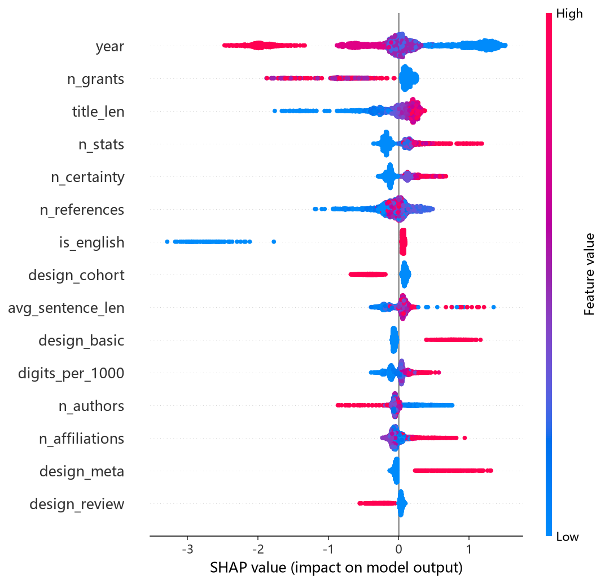

# 撤稿风险预测模型 · 实验报告

样本：23279 篇（正样本 9313 / 负样本 13966），负样本为按年份分层匹配的正常研究论文。

## 模型对比（5 折分层交叉验证，均值 ± 标准差）

| 模型 | AUC | PR-AUC | F1 | Brier |
| --- | --- | --- | --- | --- |
| 逻辑回归 | 0.795 ± 0.004 | 0.717 ± 0.008 | 0.677 ± 0.005 | 0.186 ± 0.001 |
| LightGBM | 0.856 ± 0.004 | 0.812 ± 0.008 | 0.707 ± 0.009 | 0.150 ± 0.002 |
| 随机森林 | 0.828 ± 0.006 | 0.776 ± 0.009 | 0.683 ± 0.009 | 0.186 ± 0.001 |

PR-AUC 是类别不平衡下的主指标；AUC 衡量排序能力；Brier 衡量概率校准。

## SHAP 特征重要性（对「翻车」风险的影响大小）

| 排名 | 特征 | 平均 SHAP |
| --- | --- | --- |
| 1 | 发表年份 | 0.6699 |
| 2 | 资助数 | 0.2363 |
| 3 | 标题长度 | 0.2106 |
| 4 | 统计术语数 | 0.1937 |
| 5 | 确定性措辞数 | 0.1576 |
| 6 | 参考文献数 | 0.1557 |
| 7 | 队列/观察 | 0.1514 |
| 8 | 英语文献 | 0.1378 |
| 9 | 基础研究 | 0.1180 |
| 10 | 平均句长 | 0.1145 |
| 11 | 每千字数字数 | 0.0987 |
| 12 | 作者数 | 0.0932 |
| 13 | 机构数 | 0.0900 |
| 14 | Meta/系统综述 | 0.0793 |
| 15 | 综述 | 0.0694 |
| 16 | 摘要长度 | 0.0642 |
| 17 | 模糊限定词数 | 0.0423 |
| 18 | 摘要句数 | 0.0361 |
| 19 | 病例报告 | 0.0242 |
| 20 | 夸张词数 | 0.0135 |
| 21 | RCT | 0.0027 |
| 22 | 单作者 | 0.0011 |

## 关键特征的方向（翻车组 vs 对照组的中位数）

| 特征 | 翻车组 | 对照组 |
| --- | --- | --- |
| 资助数 | 0.0 | 0.0 |
| 标题长度 | 120.0 | 110.0 |
| 统计术语数 | 1.0 | 0.0 |
| 确定性措辞数 | 0.0 | 0.0 |
| 参考文献数 | 29.0 | 29.0 |

上表为翻车组与对照组的中位数对比：哪一侧更高，即该特征在翻车组里倾向更大（SHAP 给的是影响大小，方向看这里）。

## 时序验证（用更早年份预测更晚年份）

| 模型 | 切分年份 | 训练样本 | 测试样本 | AUC | PR-AUC |
| --- | --- | --- | --- | --- | --- |
| 逻辑回归 | ≤2024 | 17169 | 6110 | 0.712 | 0.338 |
| LightGBM | ≤2024 | 17169 | 6110 | 0.715 | 0.317 |

## 诚实声明（局限）

- 样本 23279 篇，结论是「相关性」而非「因果」，不能用于判断某篇具体文献是否会被撤稿。
- 特征全部来自题录与摘要文本，拿不到全文、图表、审稿记录这些真正强的信号（图像重复、数据伪造多在正文）。
- 正样本依赖 PubMed 已标注的撤稿/存疑记录，存在检索偏倚；未被发现的撤稿仍被算作「正常」。
- **发表年份是 SHAP 第一大特征，属于删失伪迹（censoring）**：老论文有更长的时间窗口暴露撤稿，新论文「还没来得及翻车」。这解释了时序验证 PR-AUC（0.32~0.34）远低于交叉验证（0.81）——预测「未来才发生的撤稿」本质上更难。产品给出风险分时应弱化年份的解释权重。
- 小样本（360 篇）阶段「翻车文献题录更瘦」的结论在干净大样本下**不成立**：标题长度方向反转（翻车组中位数 120 vs 对照 110，反而更长），说明小样本的差异主要来自撤稿记录元数据残缺，不是写作风格。
- 数据清洗：过滤摘要过短（4345 篇）与摘要被替换成撤稿声明的记录（277 篇），前者污染长度特征，后者本身就是标签泄漏。
- 模型的价值在于「发现可疑描述模式」，作为人工审查的排序辅助，不是自动化判定。
